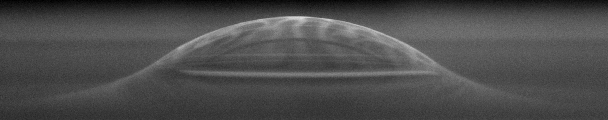

# Publications

### How emulsified droplets induce the bursting of suspended films of liquid mixtures  

**L. Delance**,  E. Santanach-Carreras, N. Passade-Boupat, F. Lequeux, L. Talini and  E. Verneuil   
*submitted*, 2024

# Kaa?

   

When observed using monochromatic light, this thin liquid film reveals interferometric patterns that allow to make precise measurements of its thickness.

# Cloudy bubble

   

Marginal regeneration in surface bubbles. The black and white patches at its surface correspond to patches of different thicknesses. This creates a flow in the liquid which eventually causes the bursting of the bubble.
