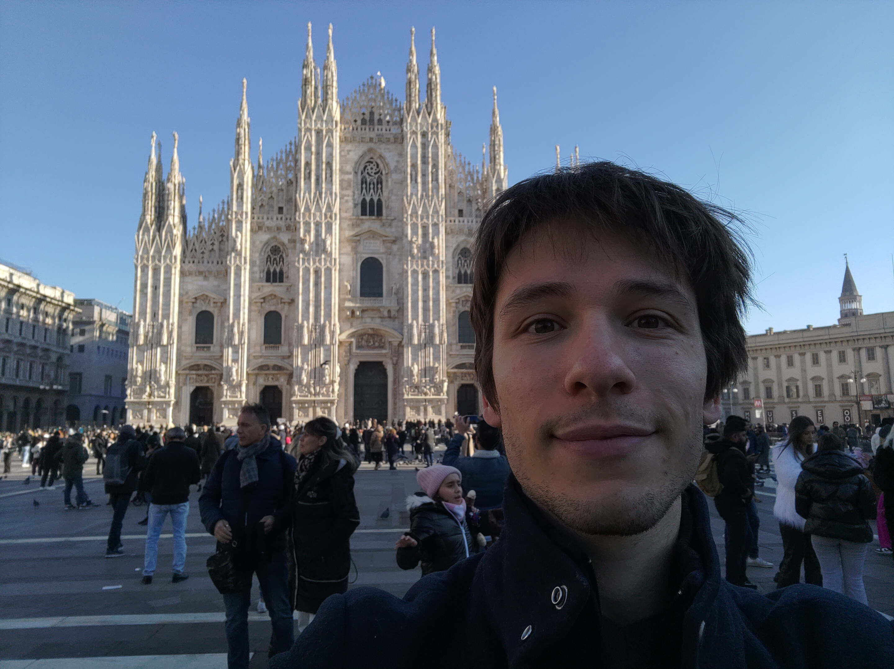

# Homepage

After obtaining a master's degree in theoretical Computer Science in [ENS de Lyon](http://www.ens-lyon.fr/), I have been a PhD student at IRIF from December 2020 to December 2023, under the supervision of [Amos Korman](https://amoskorman.com/) and [Pierre Fraigniaud](https://www.irif.fr/users/pierref/index).

Since January 2024, I am a post-doctoral researcher at the Bocconi University of Milan, with [Luca Trevisan](https://lucatrevisan.github.io/).

## Research interests

I am interested in computational aspects of stochastic systems inspired  by animal and human behavior. I focus on groups of individuals (e.g.,  birds, fishes, insects) facing collective challenges (e.g., navigation  and foraging). My projects typically involve one or several of the  following ingredients.

- **Distributed computing**: Identifying the most efficient way for a group of individuals to perform collective tasks;
- **Stochastic processes**: Accounting for the presence of noise (lack of information, lack of organization, miscommunications, mistakes);
- **Game Theory**: Taking into account selfish behaviors and competition between individuals.

## Contact information

&emsp; Robin Vacus   
&emsp; Postdoctoral researcher   

&emsp; Department of Computing Sciences, office 4-A3-03   
&emsp; Bocconi University, Milan, Italy   
&emsp; [On the map](https://maps.app.goo.gl/QWWZPcZBChf3x9BR6)

&emsp; Email: robin.vacus(at)unibocconi.it

 
