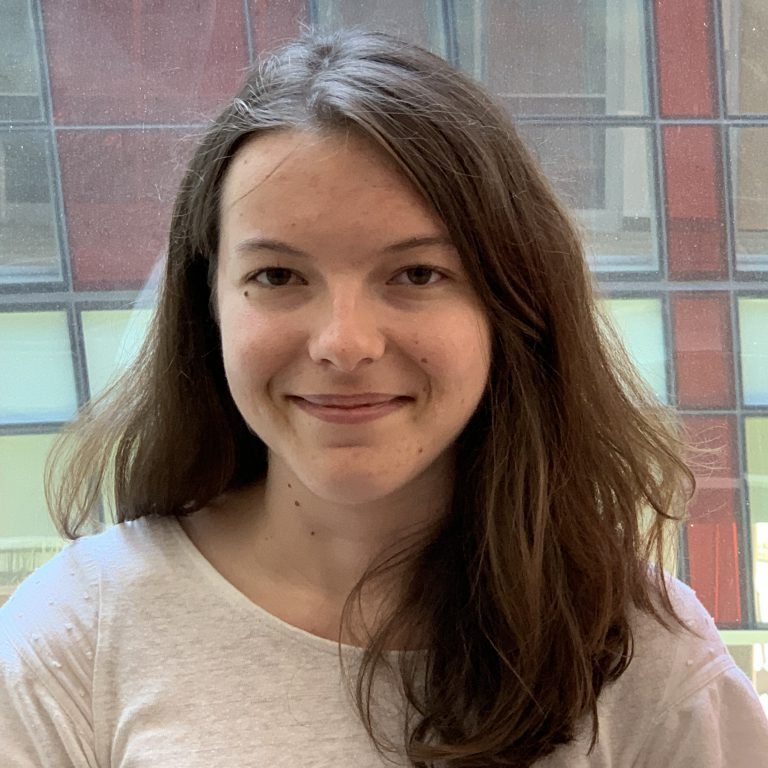

# Homepage

Since 2024, I have been a post-doctoral researcher at the Max Planck Institute for Polymer research (Mainz, Germany) in the group of [Prof. H.-J. Butt](https://www.mpip-mainz.mpg.de/en/butt). From 2020 to 2023, I did my PhD in the SIMM lab ([ESPCI Paris](https://www.espci.psl.eu/en/)) under the supervision of François Lequeux, Laurence Talini and Emilie Verneuil. I have been a [ENS de Lyon](http://www.ens-lyon.fr/) student from 2017 to 2020, where I obtained a master’s degree in Physics.

## Research interests

My research topics include the physics of foams, emulsions and wetting.
During my [PhD](https://pastel.hal.science/tel-04359779/), I researched the effect of antifoaming additives on the foaming of organic liquids. This led me to experimentally investigate the interactions between microdroplets and air-liquid interfaces across various scales ranging from foams to bubbles and suspended thin liquid films. For this purpose, I used techniques like light interferometry, dynamic light scattering and tensiometry. I also enjoy developing in-house experiments and codes for image analysis.

## Contact information

&emsp; Léa Delance   
&emsp; Postdoctoral researcher   

&emsp; Max Planck Institute for Polymer Research - Office 0.007   
&emsp; Mainz, Germany   
&emsp; [On the map](https://maps.app.goo.gl/yp7wkx2vky3enpVx9)

&emsp; Email: **delancel@mpip-mainz.mpg.de**

 
