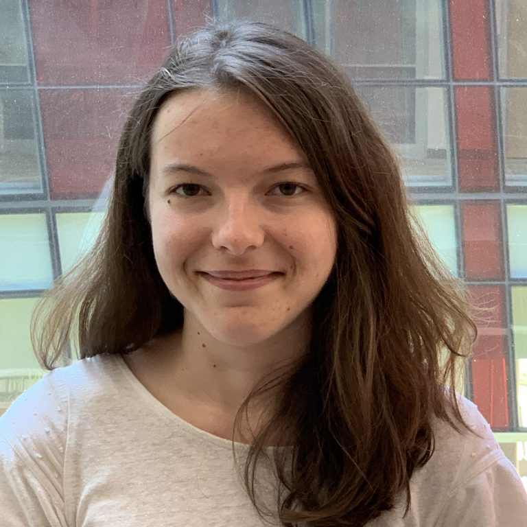

# Homepage

Since March 2026, I have been a [post-doctoral researcher](https://ipr.univ-rennes.fr/en/highlights/lea-delance-and-hector-ignacio-urra-urra-post-doctoral-researchers-ipr) at the Institut de Physique de Rennes in the group of [François Peaudecerf](https://ipr.univ-rennes.fr/interlocuteurs/francois-peaudecerf). From 2024 to 2025, I did a postdoc at the Max Planck Institute for Polymer research (Mainz, Germany) in the group of [Prof. Hans-Jürgen Butt](https://www.mpip-mainz.mpg.de/en/butt). From 2020 to 2023, I did my PhD in the SIMM lab ([ESPCI Paris](https://www.espci.psl.eu/en/)) under the supervision of François Lequeux, Laurence Talini and Émilie Verneuil. I have been a [ENS de Lyon](http://www.ens-lyon.fr/) student from 2017 to 2020, where I obtained a master’s degree in Physics.

## Research interests

My research, primarily experimental, focuses on soft matter, with a particular interest in the dynamics of foams, emulsions, and droplets. I seek to understand the evolution of these systems by emphasizing the small-scale physical phenomena that occur at interfaces, whether liquid-liquid, air-liquid, or liquid-solid, and, more recently, their coupling with bacterial dynamics. For this purpose, I use various imaging (optical microscopy, interferometry, AFM) and characterization (rheology, dynamic light scattering, tensiometry) techniques. I also enjoy developing in-house experiments and codes for image analysis.

## Contact information

&emsp; Léa Delance   
&emsp; Postdoctoral researcher   

&emsp; Institut de Physique de Rennes - Office 032/4   
&emsp; Rennes, France   
&emsp; [On the map](https://maps.app.goo.gl/UR3nxa5AgigYNK2DA)

&emsp; Email: **lea.delance@univ-rennes.fr**

&emsp;  ⚠️ **My MPIP email address is no longer valid!**
 
